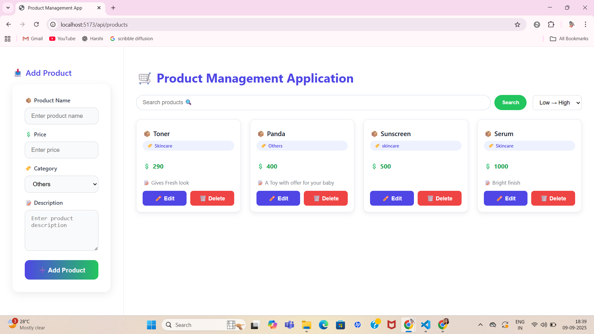

# Product Management System

A simple and elegant **Product Management System** built with **React.js**.  
This project allows users to **add, edit, and delete products** with categories, price, and description. The interface is **clean, responsive, and user-friendly**, designed for a modern web application feel.

---
# Backend (Express + MongoDB)

## Setup
1. `cd backend`
2. Copy `.env.example` to `.env` and adjust `MONGO_URI` if needed.
3. Install deps: `npm install`
4. Run dev server: `npm run dev` (or `npm start`)

## Endpoints
- `GET /api/products` - list products (optional search: `?q=phone`)
- `POST /api/products` - create product `{ name, price, description?, category? }`
- `PUT /api/products/:id` - update a product (optional feature)
- `DELETE /api/products/:id` - delete product
## Features

- **Add Product**: Add new products with name, price, category, and description.  
- **Edit Product**: Modify existing products with inline editing.  
- **Delete Product**: Remove products easily with a single click.  
- **Responsive UI**: Works seamlessly on desktop and mobile screens.  
- **Clean & Modern Design**: Elegant color palette, smooth shadows, and hover effects.  
- **Search & Filter** (if implemented): Quickly find products by name or category.  

---

## Tech Stack

- **Frontend**: React.js, HTML5, CSS3  
- **State Management**: React Hooks (`useState`)  
- **Styling**: CSS with modern, professional design  
- **Optional Backend**: Can be connected to a REST API or mock JSON data  

---

## Project Structure

## Usage

--Use the Add Product Form on the left to create a new product.

--Products appear in the Product List on the right.

--Click Edit on any product card to update details.

--Click Delete to remove a product.

--Optional: Use the search bar or category filter to quickly find products.

## Screenshots
